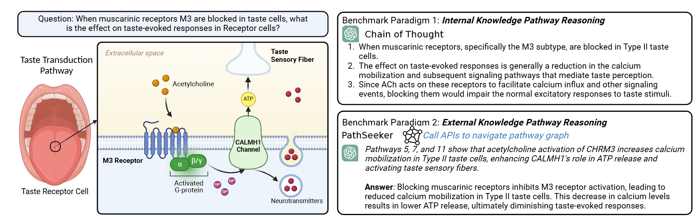
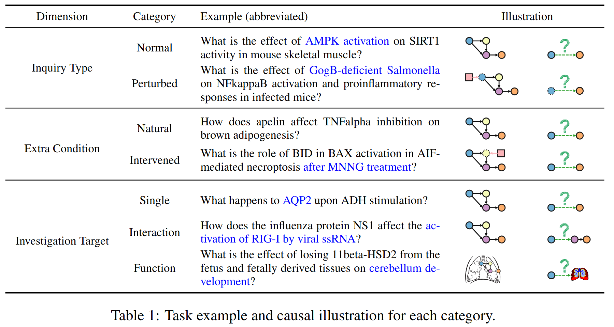
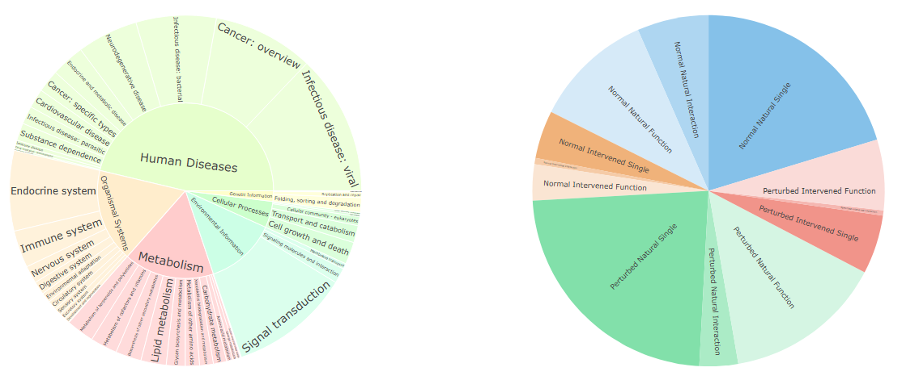
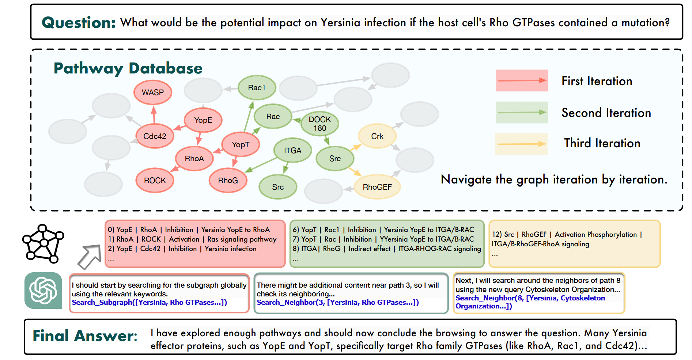

<h1 align="center"> BioMaze: Benchmarking and Enhancing Large Language Models for Biological Pathway Reasoning </h1>

## News

**2025.2.21** The paper is released on arxiv: https://arxiv.org/pdf/2502.16660.

## Overview

In this work, we evaluate the understanding and reasoning abilities of LLMs for biology tasks through the lens of
biological pathways. We explore their potential applications in key pathway research areas, including functional
understanding, dynamic changes, regulation, and intervention.



To support these investigations, we introduce a pathway benchmark, BioMaze, which comprises 5.1K high-quality, complex
biological pathway problems derived directly from real research literature.

Tasks are meticulously curated and checked by experts to cover biological pathway research contexts, including natural
dynamic changes, disturbances and interventions, additional intervention conditions, and multi-scale research targets
such as single factors, interaction processes, and macro-level functions.

The dataset is available at huggingface 🤗: https://huggingface.co/datasets/haitengzhao/BioMaze.




Besides Chain-of-Thought (CoT) and existing graph-augmented reasoning approaches，we also propose PathSeeker, a novel LLM
agent that interactively reasons through subgraph-based global-local navigation within pathway graph to better to
leverage pathway databases for reasoning.



## Installation

To run **BioMaze**, clone the repository to your local machine and install the required dependencies using the script
provided. The environment has been tested with `Python 3.10` and `CUDA 12.2`. If you're using a different version of
Python, you might need to adjust package versions accordingly.

#### Environment

```
conda create -n env_pathway python=3.10 -y
source activate env_pathway

pip install numpy==1.26 
pip install vllm==0.7.1

pip install -r requirements.txt vllm==0.7.1
```

#### LLM Directory Configuration

Please set your LLM directory in **backbone/model_dir_config.yaml** to enable convenient model loading by specifying
only its name.

#### Pathway Graph Corpus for Retriever

To enable retrieval, a detailed corpus for each pathway entity as the retrieval key is necessary. Our corpus is
available on Google Drive https://drive.google.com/file/d/1wMG9CMDdX8eXrvBF3yssnYuEZwJMpBru/view?usp=sharing. Please download it and place it in **dataset/pathway_graph_env/overall_entries.json**.

#### Set OpenAI Keys (If You Want to Evaluate GPT)

The OpenAI key can be set in **openai_keys.txt**.

## Evaluate LLMs on BioMaze

The **BiaMaze** dataset will be automatically downloaded by Hugging Face during the evaluation.

You can evaluate LLMs with the following script:

### CoT (Chain of Thought)

#### Inference with GPT-3.5

To run inference with GPT-3.5, execute the following commands:

```
python downstream_test.py --exp_id 0 --dataset_name biomaze_judge --planning_method cot --model_name gpt-35 --resume --in_context_num 2 --answer_type judge --enable_cot --temperature 0.3 
python downstream_test.py --exp_id 0 --dataset_name biomaze_reasoning --planning_method cot --model_name gpt-35 --resume --in_context_num 2 --answer_type reasoning --evaluate_model gpt-4o --enable_cot --temperature 0.3
```

For open-ended tasks (**biomaze_reasoning**), you can set the evaluator LLM using **--evaluate_model** (gpt-4o as
default). You can also specify **--no_evaluation** to skip evaluation during inference and run it later (recommended for
speed up).

#### Inference with a Local Model (i.e., Llama3.1)

To use a locally hosted Llama3.1 model via vLLM, the command is the same:

```
python downstream_test.py --exp_id 0 --dataset_name biomaze_judge --planning_method cot --model_name Meta-Llama-3.1-8B-Instruct --host 8000 --resume --in_context_num 2 --answer_type judge --enable_cot --temperature 0.3
```

We also provide script to host vLLM and conduct the distributed inference:

```
./distributed_test.sh $ModelName $TaskName $ProcessPerHost $StartTestId $Temperature $JobName $TotalHostNum
```

For example, performing inference with Meta-Llama-3.1-8B-Instruct on a single host (using one GPU) and ten distributed
test processes:

```
./distributed_test.sh Meta-Llama-3.1-8B-Instruct biomaze_judge cot 10 0 0.3 cot_biomaze_judge_llama3.1_8b 1
./distributed_test.sh Meta-Llama-3.1-8B-Instruct biomaze_reasoning cot 10 0 0.3 cot_biomaze_reasoning_llama3.1_8b 1
```

### ToG (Think on Graph)

#### Inference with GPT-3.5

```
python downstream_test.py --exp_id 0 --dataset_name biomaze_judge  --planning_method tog --model_name gpt-35  --max_length 1024 --temperature_exploration 0.4 --temperature_reasoning 0 --width 3 --depth 6 --remove_unnecessary_rel True --num_retain_entity 5 --prune_tools llm --resume  --answer_type judge --answer_method conclusion  --remove_uncertainty
python downstream_test.py --exp_id 0 --dataset_name biomaze_reasoning  --planning_method tog --model_name gpt-35  --max_length 1024 --temperature_exploration 0.4 --temperature_reasoning 0 --width 3 --depth 6 --remove_unnecessary_rel True --num_retain_entity 5 --prune_tools llm --resume  --answer_type reasoning --evaluate_model gpt-4o --answer_method conclusion  --remove_uncertainty
```

#### Distributed Test with Local Model

```
./distributed_test.sh Meta-Llama-3.1-8B-Instruct biomaze_judge tog 10 0 0.4 tog_biomaze_judge_llama3.1_8b 1
./distributed_test.sh Meta-Llama-3.1-8B-Instruct biomaze_reasoning tog 10 0 0.4 tog_biomaze_reasoning_llama3.1_8b 1
```

### CoK(Chain of Knowledge)

#### Inference with GPT-3.5

```
python downstream_test.py --exp_id 0 --dataset_name biomaze_judge  --planning_method cok --max_pieces 3 --model_name gpt-35 --resume --in_context_num 2  --max_length 1024 --answer_type judge  --temperature 0.3
python downstream_test.py --exp_id 0 --dataset_name biomaze_reasoning  --planning_method cok --max_pieces 3 --model_name gpt-35 --resume --in_context_num 2  --max_length 1024 --answer_type reasoning --evaluate_model gpt-4o  --temperature 0.3
```

#### Distributed Test with Local Model

```
./distributed_test.sh Meta-Llama-3.1-8B-Instruct biomaze_judge cok 10 0 0.3 cok_biomaze_judge_llama3.1_8b 1
./distributed_test.sh Meta-Llama-3.1-8B-Instruct biomaze_reasoning cok 10 0 0.3 cok_biomaze_reasoning_llama3.1_8b 1
```

### PathSeeker

#### Inference with GPT-3.5

```
python downstream_test.py --exp_id 0 --dataset_name biomaze_judge --planning_method graph_agent --model_name gpt-35  --answer_method conclusion --remove_uncertainty --uncertainty_query --cot_merge_method uncertain --answer_type judge --temperature 0.7 --resume --max_steps 20
python downstream_test.py --exp_id 0 --dataset_name biomaze_reasoning --planning_method graph_agent --model_name gpt-35  --answer_method conclusion --remove_uncertainty --uncertainty_query --cot_merge_method uncertain --answer_type reasoning --evaluate_model gpt-4o --temperature 0.7 --resume --max_steps 20
```

#### Distributed Test with Local Model

```
./distributed_test.sh Meta-Llama-3.1-8B-Instruct biomaze_judge graph_agent 10 0 0.7 graph_agent_biomaze_judge_llama3.1_8b 1
./distributed_test.sh Meta-Llama-3.1-8B-Instruct biomaze_reasoning graph_agent 10 0 0.7 graph_agent_biomaze_reasoning_llama3.1_8b 1
```
